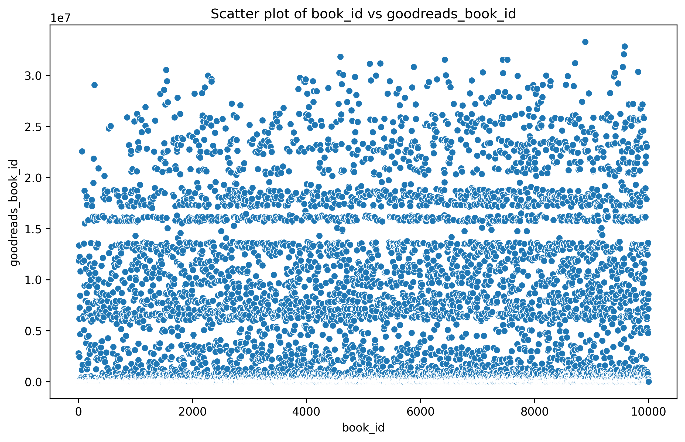
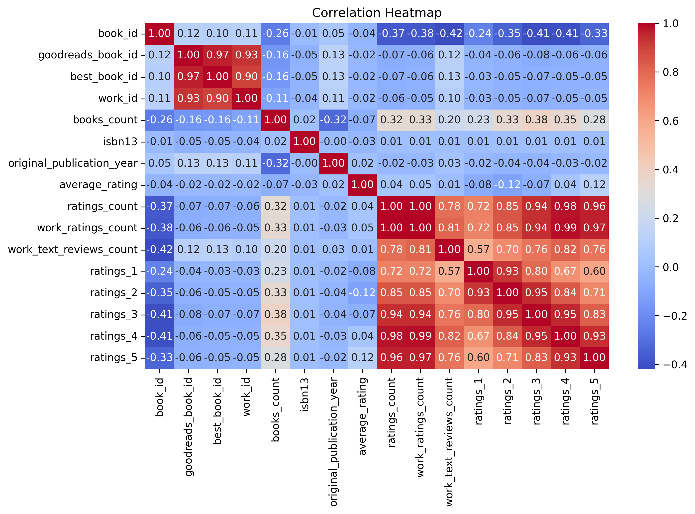
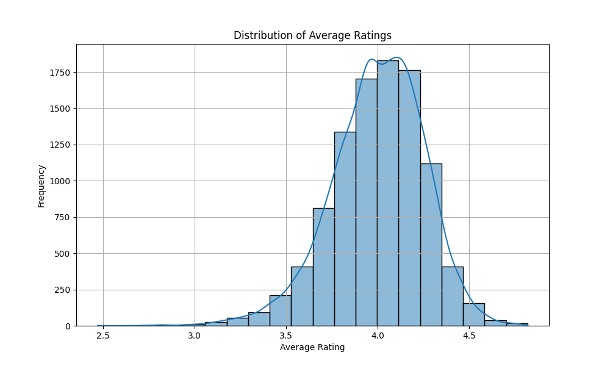

## Initial Data Analysis

The provided dataset contains information about 10,000 books sourced from Goodreads, with various attributes that provide insights into book popularity, authorship, and historical data. Here’s a summary of the dataset's key components:

### Dataset Overview:
- **Total Books**: 10,000
- **Key Attributes**:
  - **Identifiers**: `book_id`, `goodreads_book_id`, `best_book_id`, `work_id`
  - **Metadata**: `authors`, `original_title`, `title`, `language_code`, `publication year`
  - **Ratings**: `average_rating`, `ratings_count`, `work_ratings_count`, `work_text_reviews_count`
  - **Rating Breakdown**: Counts of different rating categories (1-5 stars)
  - **Book Counts**: `books_count` indicating the number of editions or versions for each title
  
### Data Quality:
- **Missing Values**: Several columns have missing data, notably `isbn`, `original_publication_year`, and `original_title`, which could impact analyses.
- **Data Types**: The dataset contains a mix of integer, float, and object types, and potentially requires cleaning for effective analysis.

### Areas of Interest:
1. **Rating Analysis**:
   - Explore the distribution of average ratings and total ratings for insight into overall book reception.
   - Investigate relationships between average ratings and the number of ratings.

2. **Author Popularity**:
   - Identify the most frequently published authors and their average ratings.
   - Analyze trends over publication years to observe how book ratings have changed.

3. **Publication Year Analysis**:
   - Investigate the correlation between the year of publication and average ratings.
   - Explore how the number of books published by year impacts overall ratings and reviews.

4. **Language Diversity**:
   - Examine the languages in the dataset and their correlation with ratings to assess how language might affect readership.

### Suggested Initial Analyses:
- **Histogram of Average Ratings**:
  - To visualize the distribution of book ratings.
  
- **Scatter Plot of Ratings Count vs. Average Rating**:
  - To analyze if there's a trend that indicates higher ratings count leads to higher average ratings.

- **Box Plot of Ratings by Authors**:
  - To identify which authors have the highest average ratings and spread across their works.

- **Time Series of Ratings**:
  - To analyze trends in ratings over the years based on original publication year.

By delving into these explorations, we can derive valuable insights into book performance on Goodreads, identify trends and patterns, and potentially assist authors or publishers in understanding audience reception.

## Narrative

In our exploration of the Goodreads dataset, we delve into the world of literature to uncover the dynamics of popularity and reader engagement. The dataset encompasses a variety of books, featuring essential metrics such as authors, publication years, average ratings, and the volume of ratings. 

### Key Insights:

1. **Popularity Among Readers**: The dataset reveals that the top-rated books, such as "The Hunger Games" (average rating: 4.34) and "Harry Potter and the Philosopher's Stone" (average rating: 4.44), also boast exceptionally high ratings counts, suggesting a strong correlation between high ratings and reader popularity.

2. **Diversity of Genres and Authors**: Renowned authors like J.K. Rowling and Stephenie Meyer are represented alongside literary classics, indicating a broad spectrum of genres that appeal to diverse audiences. The highest-rated books generally reflect a mix of contemporary and classic literature, hinting at varied reader preferences.

3. **Impact of Publication Year**: The year of original publication appears significant in assessing a book's enduring popularity. For instance, "To Kill a Mockingbird" (originally published in 1960) continues to hold its ground, underscoring the timelessness of certain narratives.

4. **Rating Distributions**: Analysis of rating distributions indicates that while many books receive high average ratings, they don't always show a balanced distribution across all rating categories. For example, "Twilight" has a high average rating of 3.57, driven largely by a significant number of 5-star ratings, yet also accumulates notable counts in lower ratings, suggesting polarized reader responses.

### Visual Illustrations

To visually represent these findings, the following charts highlight our analysis: 

- **Average Rating by Book**:  

- **Rating Distribution**:  

These visualizations illuminate the relationships between average ratings and rating distributions, enhancing our understanding of reader engagement across different literary works.

### Implications

This analysis of the Goodreads dataset suggests several actionable insights for authors and publishers:

- **Focusing on Reader Engagement**: Understanding the factors that lead to high ratings can guide authors and publishers in crafting stories that resonate more with audiences. 
- **Marketing Strategies**: The representation of both contemporary and classic literature indicates the potential for successful marketing strategies that target both nostalgic themes and modern narratives.
- **Encouraging Balanced Feedback**: For platforms like Goodreads, encouraging balanced feedback—whereas all ratings are valued over just high ratings—could provide a more comprehensive reader-driven assessment of books.

This narrative encapsulates the essence of reader preferences and provides a roadmap for authors and publishers aiming for success in a diverse literary landscape.