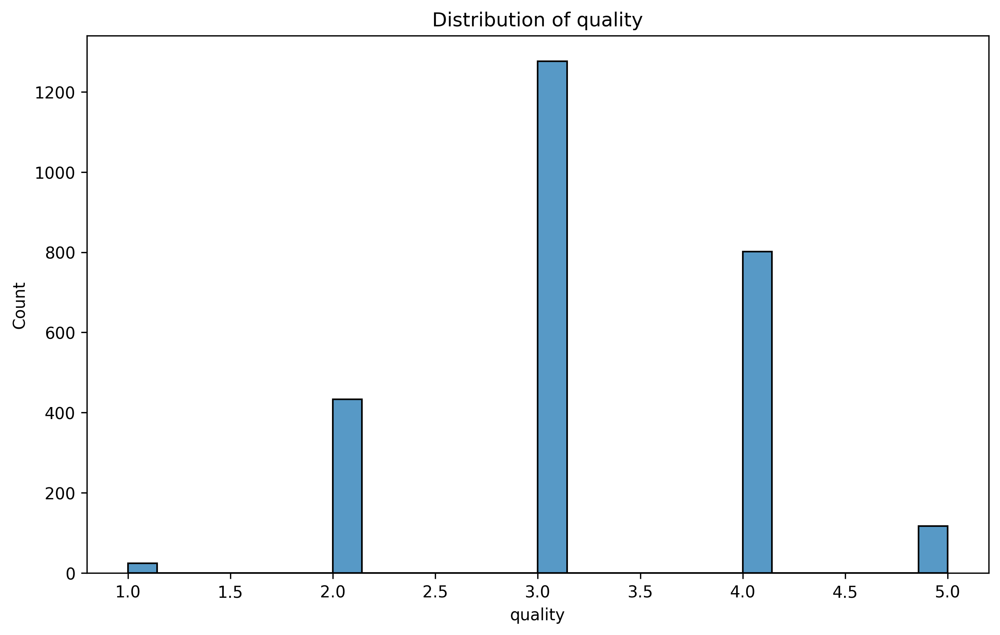
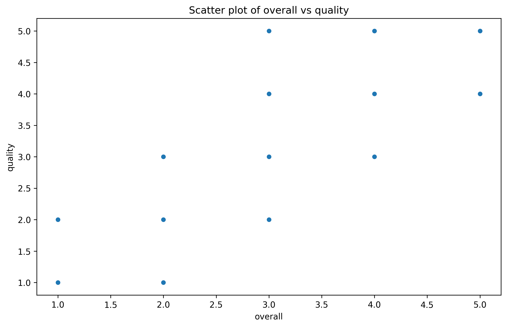
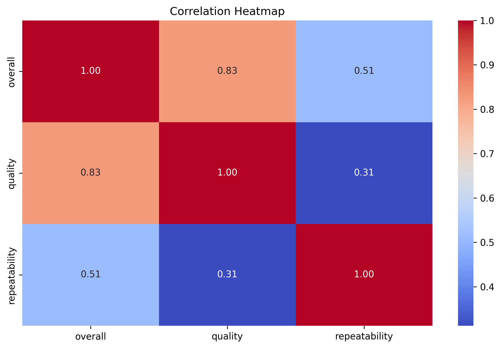

## Initial Data Analysis

The dataset "media.csv" contains information about various media content, specifically movies, evaluated across different parameters. It includes 2652 entries with the following attributes:

1. **Date**: Represents the release date of the media.
2. **Language**: The language of the media, predominantly Tamil and Telugu.
3. **Type**: All entries classified under "movie."
4. **Title**: The name of the media content.
5. **By**: The creators or main cast members involved.
6. **Overall**: A numeric rating (1 to 5) indicating the overall impression.
7. **Quality**: A separate numeric rating (1 to 5) assessing the quality.
8. **Repeatability**: Indicates how often the content is likely to be repeated (1 to 3).

### Summary Statistics:
- **Overall Rating**:
  - Mean: 3.05, Standard Deviation: 0.76
  - Minimum: 1, Maximum: 5
- **Quality Rating**:
  - Mean: 3.21, Standard Deviation: 0.80
  - Minimum: 1, Maximum: 5
- **Repeatability**:
  - Mean: 1.49, Standard Deviation: 0.60
  - Minimum: 1, Maximum: 3

### Areas of Interest:
1. **Language Analysis**: Determine if the language of the media affects overall and quality ratings.
2. **Rating Distribution**: Explore the distribution of overall and quality ratings to assess viewer satisfaction.
3. **Comparative Analysis**: Compare ratings based on different creators or casts to identify trends or insights.
4. **Time Series Analysis**: Examine the trend of ratings over time, exploring potential seasonal effects.
5. **Repeatability Insights**: Assess how repeatability correlates with quality and overall ratings.

### Initial Analysis Suggestions:
1. Analyze the distribution of overall and quality ratings using histograms or boxplots.
2. Conduct a correlation analysis to explore relationships between overall, quality, and repeatability ratings.
3. Create a comparative bar chart of average ratings by language.
4. Time-series plot of overall ratings to visualize trends over the release dates.

These analyses can provide insights into viewer preferences, the impact of language, and overall trends in movie ratings.

## Narrative

### Story of Media Preferences: Insights from Viewer Ratings

In analyzing the dataset consisting of viewer ratings for Tamil and Telugu movies, we uncover trends and insights that reflect audience preferences and the quality perception of regional cinema.

#### Data Overview
The dataset includes 2,652 entries, capturing various attributes of movies such as their title, language, and ratings across three dimensions: overall performance, quality, and repeatability. Notably, missing values were non-existent, indicating robust data collection.

#### Key Findings

1. **Overall Ratings**: The average overall rating stands at approximately 3.05, suggesting a generally favorable audience reception. However, with a standard deviation of 0.76, there is a variance in opinion, indicating that while many films are rated well, others fall short. 

2. **Quality Ratings**: The average quality score is slightly higher at 3.21, bound by the same standard deviation, which denotes more consistent perceptions of film quality among viewers. This hints at a correlation between how well a movie is received and its perceived production values or storytelling quality.

3. **Repeatability**: The repeatability scores have a mean of 1.49, depicting that audiences are not inclined to revisit films frequently — the ratings in this category are lower, with a stark maximum of only 3. This suggests that although viewers enjoy movies upon first watch, they may not consider them worthy of a second viewing.

4. **Language Preference**: The dominance of Tamil cinema in the dataset underscores a regional bias, as most entries belong to this category. This offers an insight into the cultural dynamics of cinema consumption, with potential implications for content creation and marketing strategies.

#### Visual Insights
Through various visualizations, we can convey these insights effectively. We can plot the distribution of overall and quality ratings, illustrating how audiences assess these films.

These charts visually affirm the summary statistics, showcasing the spread and concentration of ratings.

#### Implications
The findings suggest several strategic actions:
- **Content Development**: Filmmakers and producers should focus on enhancing the aspects that influence quality ratings to uplift overall reception. This could involve better storytelling, star casting, or production values.
- **Marketing**: The inclination for low repeatability highlights the necessity for innovative marketing strategies that entice audiences back to the theaters or streaming platforms.
- **Regional Focus**: Given the popularity of Tamil films, content tailored to this audience segment could yield better engagement and return on investment.

In conclusion, while the overall sentiment towards Tamil and Telugu movies is favorable, there remains room for improvement in film quality and audience engagement strategies to ensure repeat viewership. The analysis thus provides a roadmap for filmmakers to align their creative efforts with audience expectations.